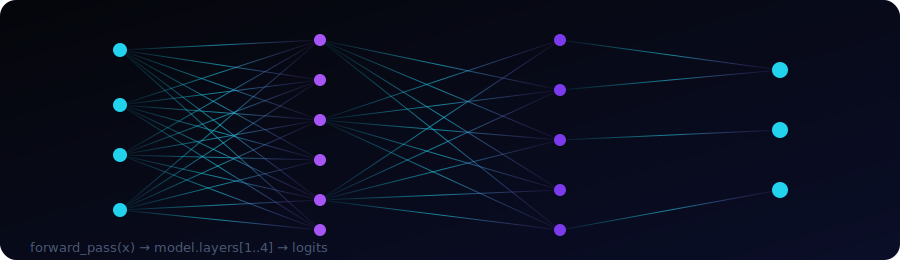

<div align="center">

[](https://github.com/MominaAzam07)



[](https://git.io/typing-svg)

<a href="https://www.linkedin.com/in/momina-azam-4966631b6/"></a>
<a href="mailto:mominasazams@gmail.com"></a>
<a href="https://twitter.com/momina_azam7"></a>
<a href="https://mominadevportfolio.netlify.app/"></a>

</div>


<!-- ============================================= -->
<!--                PROFILE  INTRO                  -->
<!-- ============================================= -->

<table width="100%">
<tr>
<td width="180" align="center" style="background:#05060B;">

</td>
<td style="background:#05060B; padding: 18px;">

**Momina Azam** &nbsp;·&nbsp; `Software Developer, building toward AI Engineering`

📍 &nbsp;Pakistan &nbsp;&nbsp;|&nbsp;&nbsp; 🕐 &nbsp;PKT (UTC+5)

I design and ship systems at the intersection of **computer vision, applied machine learning, and full-stack engineering**, from research pipelines to production automation tools that eliminate repetitive loops. I care about models that ship, not models that demo.

</td>
</tr>
</table>


<!-- ============================================= -->
<!--            ANIMATED NEURAL NETWORK             -->
<!-- ============================================= -->

<div align="center">

### 🧬 Neural Signal



</div>


<!-- ============================================= -->
<!--              INTERACTIVE TERMINAL              -->
<!-- ============================================= -->

<div align="center">

### 💻 whoami



</div>


<!-- ============================================= -->
<!--                CURRENTLY / PHILOSOPHY          -->
<!-- ============================================= -->

## 01- Signal

<table width="100%">
<tr>
<td width="50%" valign="top">

**Currently**
- Researching via computer vision
- Building full-stack, ML-backed products end to end
- Automating manual workflows

</td>
<td width="50%" valign="top">

**Philosophy**
- Ship the smallest version that tells the truth about the idea
- A model in a notebook is a hypothesis, not a product
- Good engineering is invisible; good research is reproducible

</td>
</tr>
</table>


<!-- ============================================= -->
<!--                    STACK                       -->
<!-- ============================================= -->

## 02- Stack
 
<table width="100%">
<tr>
<td width="160" valign="middle"><strong>Languages &amp; Core</strong></td>
<td valign="middle"></td>
</tr>
<tr><td colspan="2" height="10"></td></tr>
<tr>
<td width="160" valign="middle"><strong>Frontend</strong></td>
<td valign="middle"></td>
</tr>
<tr><td colspan="2" height="10"></td></tr>
<tr>
<td width="160" valign="middle"><strong>Backend &amp; APIs</strong></td>
<td valign="middle"></td>
</tr>
<tr><td colspan="2" height="10"></td></tr>
<tr>
<td width="160" valign="middle"><strong>AI / ML / CV</strong></td>
<td valign="middle"></td>
</tr>
<tr><td colspan="2" height="10"></td></tr>
<tr>
<td width="160" valign="middle"><strong>Data &amp; Infra</strong></td>
<td valign="middle"></td>
</tr>
<tr><td colspan="2" height="10"></td></tr>
<tr>
<td width="160" valign="middle"><strong>Tooling</strong></td>
<td valign="middle"></td>
</tr>
</table>

<!-- ============================================= -->
<!--                   RESEARCH                     -->
<!-- ============================================= -->

## 03- Research

Exploring the intersection of artificial intelligence, computer vision, and software engineering to build intelligent tools that make advanced AI more accessible, practical, and impactful.

| Track | Focus | Status |
|---|---|---|
| Computer Vision | Feature extraction | 🟢 Active |
| Applied ML | Risk classification | 🟢 Active |
| Deployment | Lightweight inference for edge / low-resource use | 🟡 Exploring |


<!-- ============================================= -->
<!--                FEATURED WORK                   -->
<!-- ============================================= -->

## 04- Featured Work

<table width="100%">
<tr>
<td width="50%" valign="top">

### 🔧 Multiconvert Suite
Full-stack platform project; architecture, auth, and API design built for scale from day one.

`React` `Node.js` `MongoDB`

</td>
<td width="50%" valign="top">

### 🤖 Social Media Automation Tool
Intelligent automation for Facebook and Instagram, streamlining content publishing and repetitive workflows.

`Python` `PyTorch`

</td>
</tr>
<tr>
<td width="50%" valign="top">

### 🎫 Ticket Automation
Playwright-driven automation replacing a manual, error-prone ticketing workflow.

`Python` `Playwright` `Automation`

</td>
<td width="50%" valign="top">

### 📋 Attendance App
Automated attendance system built with a focus on reliability over cleverness.

`Python` `Automation`

</td>
</tr>
</table>

<div align="center">

### 📦 Public Repositories

[](https://github.com/MominaAzam07/Real-Time-Chat-Application)
[](https://github.com/MominaAzam07/momina_portfolio)
[](https://github.com/MominaAzam07/Xylophone_using_flutter)

</div>


<!-- ============================================= -->
<!--             LIVE METRICS DASHBOARD             -->
<!-- ============================================= -->

## 05 — Live Metrics

<div align="center">


</div>


<!-- ============================================= -->
<!--                     PATH                       -->
<!-- ============================================= -->

## 06 — Path

```
→   CV / ML specialization
→   Automation tooling, full-stack builds
→   Shipping intelligent systems that solve real problems
→   Publishing research findings, scaling production ML
```


<!-- ============================================= -->
<!--                 ACHIEVEMENTS                   -->
<!-- ============================================= -->

## 🏆 Achievements

<div align="center">


</div>


<!-- ============================================= -->
<!--                    QUOTE                       -->
<!-- ============================================= -->

<div align="center">

### 💭

**"Ship the smallest version that tells the truth about the idea."**

<br/>

### Let's build something that matters.

<a href="mailto:mominasazams@gmail.com"></a>
<a href="https://www.linkedin.com/in/momina-azam-4966631b6/"></a>

</div>


<!--
  Accessibility & performance notes:
  - All decorative SVGs are inline  assets — no scripts, no external CSS.
  - Content is fully readable with animation disabled; nothing here requires motion to understand.
  - The capsule-render dividers double as section transitions — swap the `color` params to
    retheme the whole page, or drop them to keep a plainer, faster-loading layout.
-->
